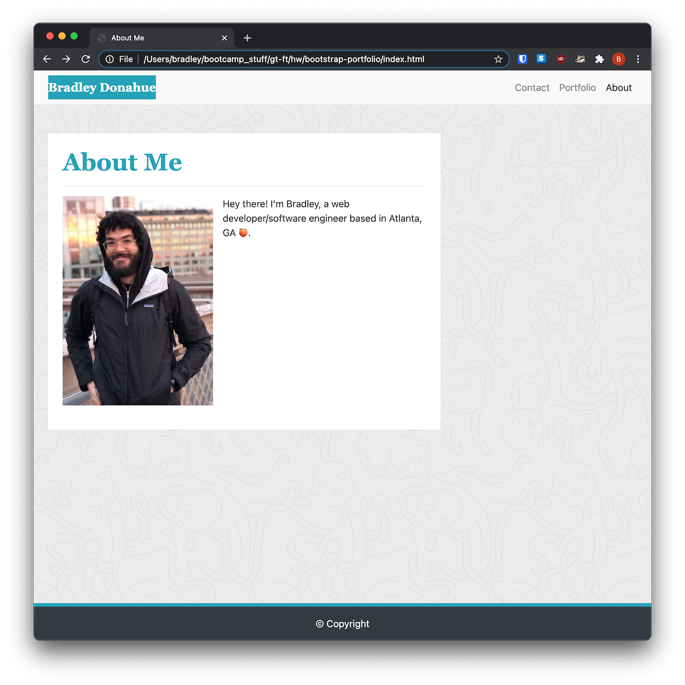

# bootstrap-portfolio

## Description
A demonstration portfolio to practice using bootstrap. Features a mobile-first responsive design leveraging [bootstrap's](https://getbootstrap.com) responsive grid system.

## Installation
`git clone` the repo to your local machine.

## Usage
Open `index.html` in your favorite browser.

## Credits
[Bootstrap Docs](https://getbootstrap.com/docs/4.5/getting-started/introduction/)

## License
MIT
